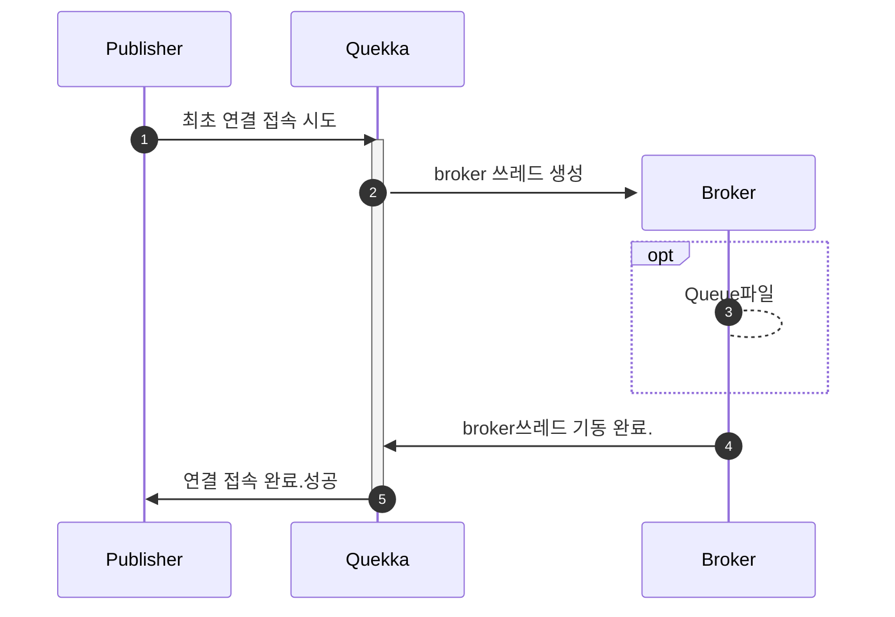
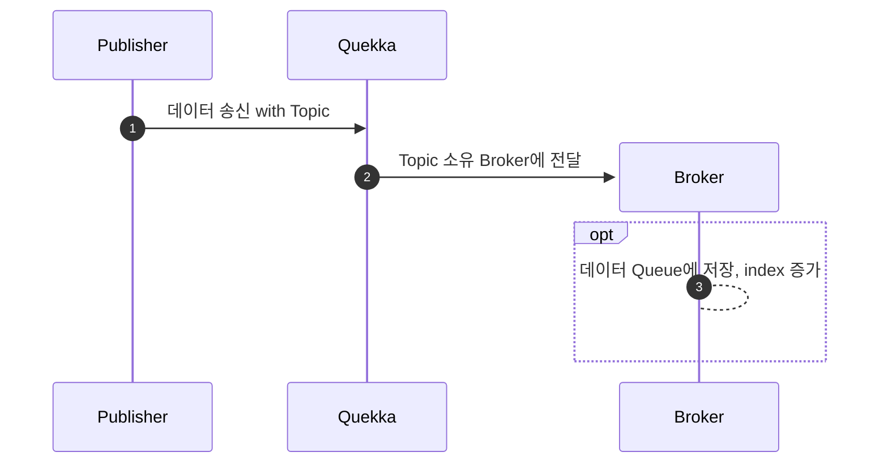
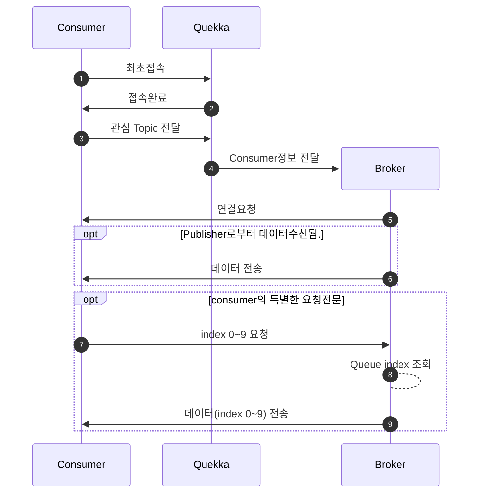

## Publisher 최초 접속

```mermaid
sequenceDiagram
    autonumber
Publisher->>Quekka: 최초 연결 접속 시도
    activate Quekka
create participant Broker
Quekka->>Broker:broker 쓰레드 생성
opt 
Broker-->Broker:Queue파일
end
Broker->>Quekka:broker쓰레드 기동 완료.
Quekka->>Publisher: 연결 접속 완료.성공
deactivate Quekka
destroy Broker
```

## Publisher Send

```mermaid
sequenceDiagram
    autonumber
Publisher->>Quekka: 데이터 송신 with Topic
create participant Broker
Quekka->>Broker:Topic 소유 Broker에 전달
opt 
Broker-->Broker:데이터 Queue에 저장, index 증가
end
destroy Broker
```
## Consumer 최초 접속 및 데이터 수신

```mermaid
sequenceDiagram
autonumber
Consumer->>Quekka: 최초접속
Quekka->>Consumer: 접속완료
Consumer->>Quekka: 관심 Topic 전달
create participant Broker
Quekka->>Broker: Consumer정보 전달
Broker->>Consumer: 연결요청
opt Publisher로부터 데이터수신됨. 
Broker->>Consumer: 데이터 전송
end
opt consumer의 특별한 요청전문
Consumer->>Broker: index 0~9 요청
Broker-->Broker:Queue index 조회
Broker->>Consumer: 데이터(index 0~9) 전송
end
destroy Broker
```
